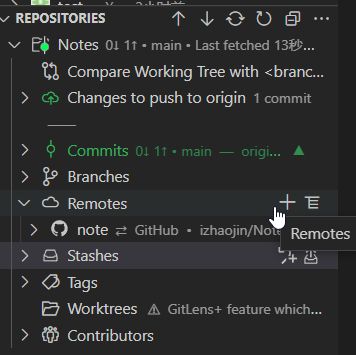

# Git使用问题记录

## Git 账户的初始化

参考[菜鸟](https://www.runoob.com/git/git-remote-repo.html)

主要步骤如下：
1. 用Git生成账户的SSH：`ssh-keygen -t rsa -C "youremail@example.com"`
2. 在GitHub中配置SSH
3. 测量连接：`ssh -T git@github.com`

## GitHub 远程仓库增删查

```
# 查看仓库
$ git remote -v
origin    git@github.com:tianqixin/runoob-git-test.git (fetch)
origin    git@github.com:tianqixin/runoob-git-test.git (push)

# 添加仓库 origin2
$ git remote add origin2 git@github.com:tianqixin/runoob-git-test.git

$ git remote -v
origin    git@github.com:tianqixin/runoob-git-test.git (fetch)
origin    git@github.com:tianqixin/runoob-git-test.git (push)
origin2    git@github.com:tianqixin/runoob-git-test.git (fetch)
origin2    git@github.com:tianqixin/runoob-git-test.git (push)

# 删除仓库 origin2
$ git remote rm origin2
$ git remote -v
origin    git@github.com:tianqixin/runoob-git-test.git (fetch)
origin    git@github.com:tianqixin/runoob-git-test.git (push)
```

## GitHub 推送

```
# 提交变更信息到Git
$ git commit -m "添加到远程"
master 69e702d] 添加到远程
 1 file changed, 0 insertions(+), 0 deletions(-)
 create mode 100644 runoob-test.txt

 # 推送到 Github: 仓库是origin，分支是master
$ git push origin master   
```

## GitHub connect error
不同GitHub repo在Git上面也要有不同的仓库名称。
默认名称是origin，当需要同事操作多个仓库的时候，需要取不同的名字
一个简单的方案如下图，在VSC上面直接点+号，可以添加一个新的Git仓库名称

下面图片的意思是本地Git仓库`note`，对应到GitHub的仓库`izhaojin/Notes`

